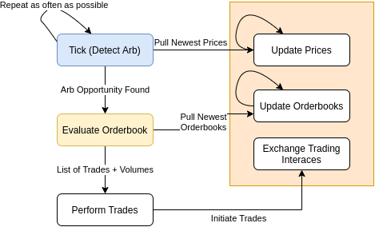

# Crypto Cex Arbitrage

  

### What is this repo?

  

This is a naive implementation of CCXT based single-asset crypto arbitrage. As is, this bot will NOT produce good results and will likely burn a lot of trading fees with no profit. After all, it's written in TypeScript for some reason, what do you expect?

  

Every tick, this will pull all relevant orderbooks from every exchange you requested. It will check for arbitrage opportunities by checking the highest bid price against the lowest ask price. If the price spread is favorable, it will simulate the full trade, and determine if the trade meets all the criteria listed in `isActionable() -> app.ts`. In production it will perform the trade, and log all results in the mongodb.

  

By setting multiple `symbols` in `util/constants.ts`, you can have this app search for arbitrage on multiple assets simultanesouly.

  

# Setup

  

**Dependencies**:  

Docker  

npm  

  

# Run Instructions

  

Clone repo.  

  

-  `cp .env.example .env`  

The default set of exchanges do not require keys to get market data, so you can leave those blank. If you add new exchanges, those may require keys to run.  

-  `npm run docker-start`  

This will create a mongodb in docker. To view entries, you can connect from the default mongo URL `http://localhost:27017/`  

  

# How To Modify

  

## Add Exchanges and Bases

  

See `util/constants.ts`.  

  

To add exchanges, add to the current list of exchanges. This uses [CCXT](https://github.com/ccxt/ccxt), so add any supported exchange id. Some exchanges require API keys to pull market data - you can add these in .env using `<exchange_id>ApiKey` and `<exchange_id>ApiSecret`  

  

To add more bases, simply append to the list of `symbols`.  

  

# Architecture

  

This diagram was created long before this was ever implemented, but it is still valid enough to include. This is the main happy-path of a tick. This does not include anything about balance management, but that is a side-process.  
  

Ticks happen as often as possbile, and each tick pulls new orderbooks for each exchange. A tick doesn't do any arbitrage analysis, but checks if there is a reasonable enough spread to analyse further. (Note, the diagram says this pulls orderbooks - it pulls them from memory, not from the network)  

  

If a good spread is found, an analysis begins in `util/orderbook.ts`, `analyzeOpportunity`  

  

The output of the analysis is a list of trades to perform (or nothing, if it was a false alarm). These trades are executed immediately. I have tried limit orders and market orders, both have their benefits and drawbacks.  

  

  

# Other Details

  

### Balance Management

  

If there are a series of failed arbtrages (where one side executes, but the other does not), you may end up with a lopsided balance, where you are holding mostly Base or mostly Quote across all your exchanges. Though it's fine for a signle exchange to hold all base or all quote, you should be holding 50% base and 50% quote by value in total. There is some logic (`rebalance` logic) which detects if your total value is lopsided, and corrects it using the best available prices on any exchange. This is pretty simple, and just requires some orderbook analysis.   

  

It gets more complicated when you are using one exchange to arb multiple assets at one time. I solved this with `controller/PoolController.ts`. PoolController splits up the available USDT, and assigns a specific protion to each base asset. For example, if you have 100 X, 100 Y, and 150 USDT on an exchange, the pool controller will keep track of which asset controls how much USDT. Isolating the pools like this simplifies rebalancing logic significantly and keeps everything cleanly separated in the case of failure.
